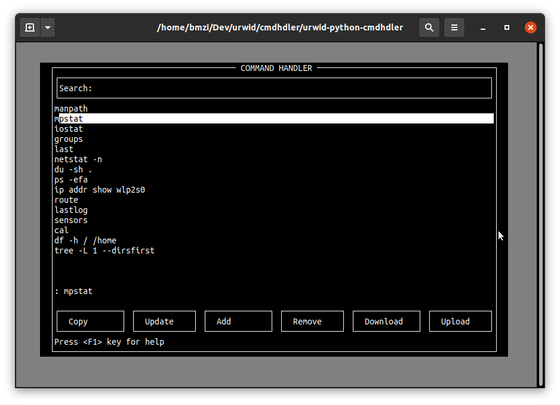

# Linux Command Handler
> Written in Python 3 using urwid(https://urwid.org) and Sqlite3 as database

This is a simple terminal-based application to manage Linux commands, on any Linux host.

You can search, run, add, update, remove any Linux command from a sqlite database.
The application also can handle uploading a file with the list of commands
into the dabase, or download all commands from database, into the same file named as
'download'.


### Requirements:
- Python 3.5 or up 
- urwid
- pyperclip

<br>
Installation of dependent packages is done by:<br>
```shell
$ pip install urwid, pyperclip
```

### How to use this app
Simply copy app.py into a directory(preferably, an empty one) and then let the application run by: <br>
```shell
$ python3 app.py
```

### Note:
If no database file provided, application will automatically creates a sample databse file with some elementary commands as demo. 
You can populate the initialized database by click on upload button while you provide a file named as 'download' with your list of commands in the same directory leval as file app.py.

Here's an image of the application main screen:



### Features
You can figure out more about the features included in this app, only by refereing to help on  shortcut keys.
Here is a snapshot of help:

            |||||||||||||||||||| SHORTCUT KEYS |||||||||||||||||||||

            tab ............. Goes to prompt. prompt is ": " and is
                              located at the bottom of command menu.

            ctrl up ............ Goes to search field.
            ctrl down .......... Goes to function window at the bottom.

            f5 ................. Restarts the app.
            f6 ................. Removes all temp files, used by app
            f8 ................. Exits app. (or use Quit button)
            
            ctrl e ............. Runs command and logs output.
            ctrl x ............. Runs command in a separate terminal.
            ctrl o ............. Open commands history.

            Copy ............... Command is copied into clipboard
            Update ............. Updates the command typed in prompt.
            Add ................ Adds the command typed in prompt.
            Remove ............. Removes selected command.
            Doownload .......... Downloads all commands to file download.
            Upload ............. Uploads file download into database.


